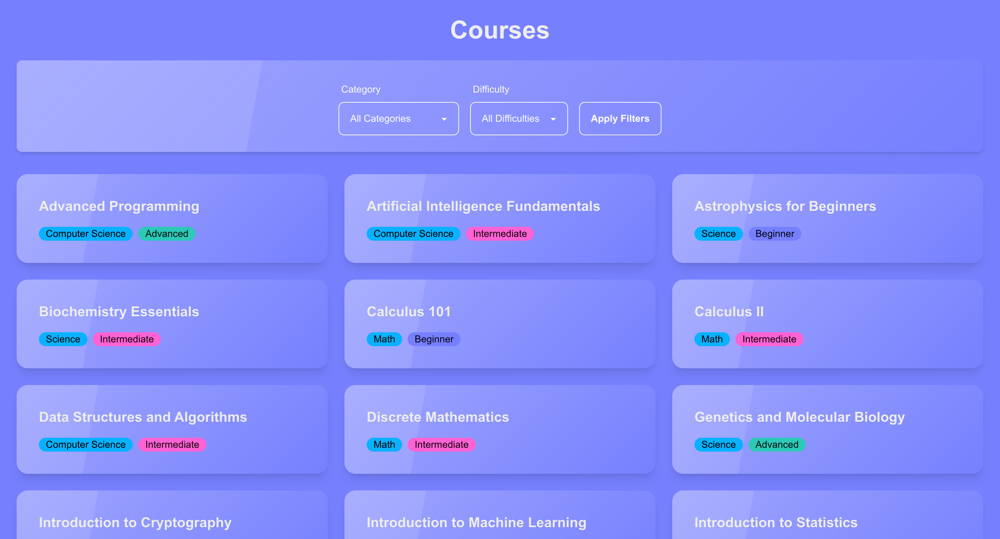

# Courses App

## Overview
Courses App is a web application that allows users to explore a variety of courses, filter them by category and difficulty. The application is built using modern technologies like Next.js, Prisma, and Tailwind CSS. It features server-side data fetching and filtering for a fast and seamless UX.

## Features
- **Filterable Course List**: Filter courses by category (e.g., Math, Science) and difficulty (e.g., Beginner, Intermediate, Advanced).
- **Server-Side Rendering**: Data fetching and filtering are handled on the server to improve performance and reduce client-side workload.
- **Dynamic Styling**: Uses Tailwind CSS with DaisyUI for responsive and visually appealing UI components.
- **Database Integration**: Data is stored and managed in a PostgreSQL database using Prisma ORM.

## Deployment

This application is deployed and accessible here: [Courses App on Vercel](https://courses-app-flax.vercel.app/)

## Preview

Here’s a quick preview of the application:



## Technology Stack

- **Framework**: [Next.js 13](https://nextjs.org/)
- **Database**: [PostgreSQL](https://www.postgresql.org/) (via [Prisma ORM](https://www.prisma.io/))
- **Styling**: [Tailwind CSS](https://tailwindcss.com/) and [DaisyUI](https://daisyui.com/)
- **TypeScript**: Strongly typed codebase
- **Hosting**: [Vercel](https://vercel.com/)

## Installation

### Prerequisites
- Node.js (>= 18.0.0)
- npm (>= 9.0.0) or yarn
- PostgreSQL database instance

### Steps
1. Clone the repository:
   ```bash
   git clone https://github.com/davewaldorf/courses-app.git
   cd courses-app
   ```

2. Install dependencies:
   ```bash
   npm install
   ```

3. Configure environment variables:
   Create a `.env` file in the root directory with the following:
   ```env
   DATABASE_URL=your_database_url
   ```

4. Generate Prisma client:
   ```bash
   npm run prisma:generate
   ```

5. Run database migrations:
   ```bash
   npm run prisma:migrate
   ```

6. Seed the database (optional):
   ```bash
   npm run seed
   ```

7. Start the development server:
   ```bash
   npm run dev
   ```

   The app will be available at `http://localhost:3000`.

## Scripts
- `npm run dev`: Start the development server.
- `npm run build`: Build the application for production.
- `npm run start`: Start the production server.
- `npm run prisma:generate`: Generate Prisma client.
- `npm run prisma:migrate`: Apply database migrations.
- `npm run seed`: Seed the database with initial data.

